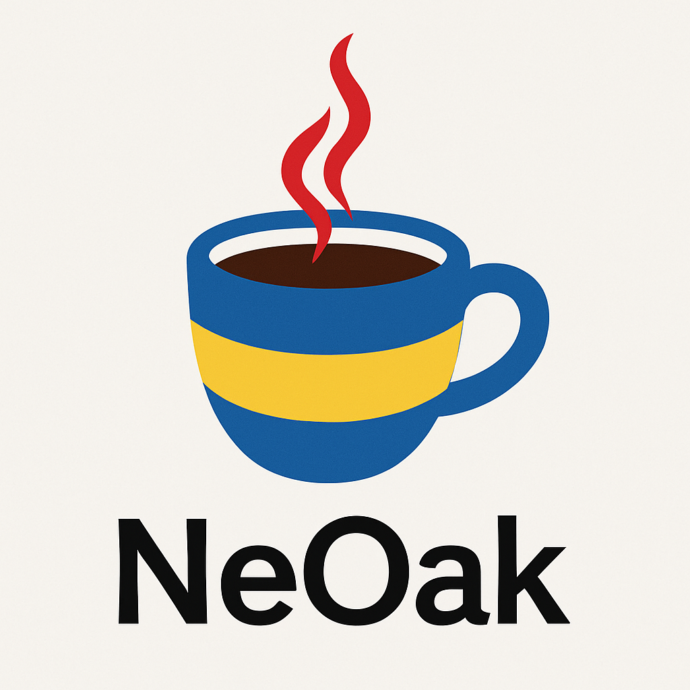

# NeOak
The Oak Project Reborn

<p align="center">
  <picture>
    <!-- Uncomment the next line and add logo-dark.png for dark mode -->
    <!-- <source media="(prefers-color-scheme: dark)" srcset="logo-dark.png"> -->
    
  </picture>
  
</p>

## Overview

NeOak is a tiny, experimental Java-like language that runs without the JVM by transpiling Java/NeOak sources to Python and executing them with Python 3. No JVM/JRE/JDK is required or invoked.

Current feature set:
- Class with `static` methods
- `public static void main(String[] args)` entrypoint
- `System.out.println(...)` and `System.out.print(...)`
- `if` / `else if` / `else`, `while`, classic `for` loops, and `for-each` (`for (T x : xs) { ... }`)
- Basic types: `int`, `double`, `boolean`, `String` (erased to Python types)
- Arrays: `new int[n]`, `new T[]{...}`, `arr.length`, indexing, foreach
- Operators: `&&`, `||`, `!`, ternary `?:`, `++/--` statements, `Math.max/min`, `instanceof`, `obj.getClass() == T.class`
- Safer `+` string concatenation when string literals are present
  - Plus semantics match Java: numeric addition until a string is encountered, then concatenation left-to-right (e.g., `1+2` → `3`, `"A"+2` → `"A2"`).

## What's New

- Generics parsing with runtime erasure: supports declarations, params, foreach, and headers; no type-arg enforcement.
- Access modifiers (instance): `private`/`protected` enforced; package-private enforced for instance methods/fields within same package.
- Statics: static fields and `static {}` initializer blocks (run once per class).
- Operators: ternary `?:`, `instanceof`, and `getClass() == T.class` rewrites.
- Graphics: tiny `StdDraw` wrapper (Tkinter) for quick demos.
- Docs: `neoak docs` generates lightweight JavaDoc-style HTML (index, packages, per-class pages).
- Diagnostics: missing semicolons detected across all files with accurate `file:line`; abstract/interface rules checked.

Exceptions and control flow:
- `try { ... } catch (A e) { ... } finally { ... }` (multi-catch with `A | B`)
- `throw new E(args)` and `throw e`
- `switch (expr)` with `case` and `default`, basic fall-through until `break;`

Instance features:
- Instance fields with optional initializers (primitive or expression)
- Constructors: `public ClassName(args) { ... }` → `__init__(self, ...)`
- `this` inside instance contexts maps to `self`
- Object creation: `new ClassName(args)`
- Instance methods callable as `obj.method(...)`
- Unqualified calls to class static methods are allowed via top-level aliases

Static members:
- Static fields with initializers (class attributes).
- Static initializer blocks (`static { ... }`) run once per class, after static field defaults.

Inheritance:
- `class Sub extends Base { ... }` generates `class Sub(Base):`
- `super(args)` in constructor maps to `super().__init__(args)`
- `super.method(args)` maps to `super().method(args)`
- If a subclass constructor exists and no explicit `super(...)` call is present, a best-effort `super().__init__()` is inserted

Overloading:
- Methods: multiple methods with the same name are supported via runtime dispatch on arity and basic types (boolean, int/double, String, lists for arrays, and class names).
- Constructors: multiple constructors are supported; field initializers run first, then the matching constructor body executes.
- Static methods: overloaded static methods dispatch similarly and remain callable as unqualified top-level functions.
- Dispatch favors the first matching overload in declaration order.

## Generics

NeOak parses Java-style generics and erases them at runtime. This means generic type arguments influence parsing and code generation (e.g., splitting and class/interface headers), but they do not affect runtime type checks.

- Supported parsing:
  - Declarations: `List<String> names;`, `Map<String, Integer> counts;`, `Foo<Bar<Baz>> nested;`
  - Constructors: `List<String> xs = new ArrayList<String>();`
  - For-each: `for (String s : new String[] {"a", "b"}) { ... }`
  - Method params: `void m(Map<String, Integer> m, List<List<String>> xs)`
  - Class/interface headers: `class Box<T> { ... }`, `interface I<T> extends J<List<T>> {}`,
    `class C<T> extends Base<List<T>> implements A<C<T>>, B<C<T>> { ... }`

- Dotted/qualified types are accepted: `java.util.List<String>`; the short class name is what matters at runtime.

- Erasure semantics and limitations:
  - Type arguments are removed in the generated Python; runtime dispatch only uses base types and array-ness.
  - No wildcard/bounds validation (`?`, `extends`, `super`) and no enforcement of element types at runtime.
  - Overload resolution does not distinguish between different parameterizations of the same generic type.

Projects and files:
- Entry file can be `Main.nk`, `Main.nk.java`, or `Main.java`.
- Place additional classes in separate files; runner loads all `.nk`, `.nk.java`, `.java` files recursively under the given directory.
- `package ...;` and `import ...;` headers are parsed and ignored for now (no enforced package namespaces yet).

## Quick Start

1. Put a `Main.nk`, `Main.nk.java`, or `Main.java` somewhere under your project directory. You can place additional classes in separate files in the same directory or subdirectories (e.g., `src/app/Person.java`, `src/app/Student.java`). The runner auto-loads all `.nk`, `.nk.java`, and `.java` files recursively under the entry directory.
2. Run the NeOak runner:

- Default run (current directory): `neoak run`
- Run a specific path: `neoak run path/to/src`
- Emit generated Python: `neoak run --emit`
- Generate docs (JavaDoc‑style): `neoak docs path/to/src --out docs`
- Local dev without install: `python3 neoak.py run` or `python3 neoak.py run path/to/src`

## Installation

Option 1 — pipx (recommended):
- Ensure pipx is installed: `python3 -m pip install --user pipx && python3 -m pipx ensurepath`
- Install from the repo root: `pipx install .`
- Then run: `neoak`

Option 2 — installer script:
- From the repo root: `bash install.sh`
- If `pipx` is not available, it falls back to `pip install --user .` and places the `neoak` script in `~/.local/bin`.

Option 3 — pip (user):
- `python3 -m pip install --user .`
- Ensure `~/.local/bin` is on your PATH.

Uninstall:
- pipx: `pipx uninstall neoak`
- pip: `python3 -m pip uninstall neoak`

Optional: emit the transpiled Python instead of running:
```
neoak run --emit
```

Generate docs (JavaDoc-style):
```
neoak docs path/to/src --out docs
open docs/index.html
```

## Project Layout

Example layout with packages for IDE compatibility:

```
src/
  app/
    Main.java        // package app;
    Person.java      // package app;
    Student.java     // package app;
```

- The CLI finds `Main.*` anywhere under the provided directory (default: current directory), in this order: `Main.nk` → `Main.nk.java` → `Main.java`.
- All sibling `.nk`, `.nk.java`, and `.java` files under that directory tree are loaded.
- Package/import lines are currently ignored by the transpiler, but keeping packages consistent helps IDEs.

## Editor Setup (VS Code)

- Ensure Java extension and a JDK are installed. In the Command Palette, run “Java: Configure Runtime” to pick a JDK.
- Mark `src` as the source root by adding `.vscode/settings.json`:

```
{
  "java.project.sourcePaths": ["src"],
  "java.configuration.updateBuildConfiguration": "automatic"
}
```

- Use a consistent package, e.g., put `package app;` at the top of all files under `src/app/`.
- For Java tooling, prefer `.java`. NeOak also accepts `.nk` and `.nk.java` files but Java IDEs may not parse `.nk.java` semantics strictly.

## Example (Main.nk)

```
class Main {
    public static void main(String[] args) {
        System.out.println("Hello from NeOak!");
    }
}

// Example with instances
class Person {
    String name;
    int age = 0;

    public Person(String name, int age) {
        this.name = name;
        this.age = age;
    }

    public String describe() {
        return this.name + ", " + this.age;
    }
}
```

## Notes

- This is not a JVM. It transpiles to Python and executes with Python 3.
- Unsupported constructs will likely cause a transpile error or unexpected behavior.
- The goal is to iterate toward broader Java compatibility over time (and possibly add a native backend).

Known limitations:
- Overload resolution is best-effort at runtime (arity + coarse types); Java numeric promotions and boxing aren’t modeled.
- Packages: namespaces/imports are not emitted yet; package-private enforced at runtime for instance members (fields/methods). Static access checks are not enforced.
- Interfaces and abstract classes are supported, but there are no interface default methods, no sealed hierarchies, and no nested/anonymous classes.
- Generics: parsed and erased at runtime (no type-arg enforcement); arrays are Python lists.
- Not compatible with `.class`/`.jar` artifacts.

## Graphics (StdDraw)

NeOak includes a tiny, Tkinter-backed drawing helper inspired by StdDraw.

- Static API on `StdDraw`:
  - `StdDraw.open(width, height, title)`
  - `StdDraw.clear([color])`, `StdDraw.setPenColor(name|r,g,b)`
  - `StdDraw.line(x0, y0, x1, y1)`
  - `StdDraw.circle(x, y, r)`, `StdDraw.filledCircle(x, y, r)`
  - `StdDraw.rectangle(x, y, w, h)`, `StdDraw.filledRectangle(x, y, w, h)`
  - `StdDraw.text(x, y, str)`
  - `StdDraw.show()`, `StdDraw.pause(ms)`, `StdDraw.close()`

Example:

```
class Main {
    public static void main(String[] args) {
        StdDraw.open(400, 300, "NeOak Graphics");
        StdDraw.clear("white");
        StdDraw.setPenColor(255, 0, 0);
        StdDraw.line(10, 10, 390, 10);
        StdDraw.setPenColor("blue");
        StdDraw.circle(200, 150, 60);
        StdDraw.setPenColor("green");
        StdDraw.filledRectangle(150, 200, 100, 40);
        StdDraw.setPenColor("black");
        StdDraw.text(200, 150, "Hello");
        StdDraw.show();
        StdDraw.pause(500);
        StdDraw.close();
    }
}
```

Notes:
- Requires Python Tkinter (usually included). If unavailable, graphics calls raise a runtime error.
- Coordinates are pixel-based from top-left.

## Reference (Early Draft)

This section summarizes the current language and runtime surface area in a quick, JavaDocs‑style outline. It will evolve into a generated reference.

Language
- Classes: `class Name [extends Base] [implements I1, I2] { ... }`
- Methods: `public|protected|private [static] T name(params) { ... }`
- Constructors: `public|protected|private Name(params) { ... }`
- Overloading: methods/constructors dispatched by arity + coarse types
- Control flow: `if/else if/else`, `while`, classic `for`, `for-each`, `switch`, `try/catch/finally`
- Operators: `&&`, `||`, `!`, ternary `?:`, `instanceof`, `getClass()==T.class`, `++/--` (statements), `+` with Java concat semantics
- Exceptions: `throw`, multi‑catch; checked exceptions not enforced
- Generics: parsed and erased at runtime (no wildcard/bounds enforcement)
- Modifiers: `public/protected/private` enforced for instance methods/fields (see Notes); static access checks pending
- Statics: static fields + `static {}` blocks

Runtime API
- `Object`
  - `getClass(): Class`, `hashCode(): int`, `equals(Object): boolean`, `toString(): String`
  - Concurrency helpers: `wait(timeout)`, `notify()`, `notifyAll()` (best‑effort)
- `Class`
  - `getName(): String`
- `Scanner`
  - `Scanner(String|Reader)`, `useDelimiter(String)`, `hasNext()`, `next()`, `nextLine()`, `nextInt()`, `nextDouble()`, `nextLong()`, `nextBoolean()`, `close()`
- `File`
  - `exists()`, `isDirectory()`, `isFile()`, `length()`, `lastModified()`, `getName()`, `getPath()`, `getAbsolutePath()`, `mkdir()`, `mkdirs()`, `list()`, `delete()`
- `StdDraw` (graphics)
  - `open(w,h,title)`, `clear([color])`, `setPenColor(name|r,g,b)`, `line(x0,y0,x1,y1)`, `circle(x,y,r)`, `filledCircle(x,y,r)`, `rectangle(x,y,w,h)`, `filledRectangle(x,y,w,h)`, `text(x,y,s)`, `show()`, `pause(ms)`, `close()`
- Helpers (generated into output)
  - `_neoak_plus(...)` for Java‑like `+` semantics, `_neoak_is_type(x,t,arr=False)` for overload checks

Notes
- Access control: instance `private/protected` is enforced via runtime checks; static members are not yet enforced. Package visibility is not modeled.
- Arrays: Python lists; no runtime enforcement of generic element type.
- Packages/imports: parsed but not enforced as namespaces yet.

## Documentation Style (JavaDoc‑like)

We plan to support JavaDoc‑style block comments and tags in NeOak sources and generate a reference site. Draft conventions:

- Use `/** ... */` above classes and methods.
- Supported tags (planned): `@param`, `@return`, `@throws`, `@since`, `@deprecated`, `@see`.

Example:

```
/**
 * A fast input scanner.
 * @since 0.1
 */
class Scanner {
    /**
     * Reads next token delimited by the current pattern.
     * @return next token as String
     * @throws NoSuchElementException if input is exhausted
     */
    public String next() { ... }
}
```

Generation Plan
- Add a `neoak docs` subcommand that:
  - Parses sources, extracts JavaDoc blocks, signatures, and tags
  - Emits Markdown/HTML into `docs/` with a simple template (search + per‑symbol pages)
  - Optionally links to source lines using existing `NEOAK_FILE` markers

If you’d like, I can scaffold `neoak docs` with a minimal parser and a basic Markdown theme as a first step.

## Why NeOak?

- Simplicity: Run Java-like code with only Python installed.
- Familiarity: Keep most of Java’s look-and-feel without the JVM.
- Fast iteration: Transpile-and-run in one command; `--emit` for debugging.
- Embeddable: Library-first design makes it easy to wire into tools.
- Portable: No bytecode or native toolchains required to start.

## Roadmap

- Packages: Real package namespaces (map `package` to modules; avoid collisions).
- Types: Better overload resolution and numeric promotions; boxing semantics.
- OOP: Interfaces, abstract classes, enums, visibility hints.
 - Generics: Parsing + erasure in place; consider erasure-aware checks and array/generic bridges.
- Stdlib: Common helpers (time, parsing, I/O) with Java-like facades.
- Imports: Classpath-style discovery, selective file inclusion, wildcards.
- Tooling: Improve errors, source maps in traces, `--check` static validation.
- Performance: Cache transpilation outputs; incremental recompilation.
- Packaging: Simple `pipx` install; optional Homebrew-style script.
- Backend: Optional C++/native backend for compiled binaries.

## Future Features

- Packages/namespaces with proper module emission and collision avoidance.
- Better overload resolution with numeric promotions and boxing semantics.
- Interfaces, abstract classes, enums, annotations, and visibility hints.
- Partial generics support (erasure-aware checks, array/generic bridges).
- Standard library shims (time, parsing, I/O, collections) with Java-like APIs.
- Imports/classpath: selective inclusion, wildcards, and dependency sets.
- Diagnostics: improved error messages, source maps for tracebacks, `--check` mode.
- Performance: transpilation cache, incremental builds, parallel file loading.
- Debugger hooks and stepping aligned to source lines.
- C++/native backend option for building standalone binaries.

## How It Works

NeOak behaves like “Java without the JVM”. You write Java‑like sources; the CLI gathers them, transpiles to Python, and executes. A tiny Python shim provides core Java behaviors so you don’t need a JRE.

**Pipeline:**
- **Discovery:** The CLI finds `Main.nk` → `Main.nk.java` → `Main.java` under your project root and loads all sibling `.nk`/`.nk.java`/`.java` files recursively. It also prepends a small stdlib (`neoak/stdlib/java/...`) so IDEs see familiar packages.
- **Preprocess:** Removes comments; treats `package`/`import` for IDEs only. Adds file markers so later errors map back to original files.
- **Parse:** Scans for classes, interfaces, fields, methods, constructors (regex‑guided). Records `abstract/extends/implements` info.
- **Checks:**
  - **Semicolons:** Requires `;` on top‑level statements and reports “Missing semicolon at file:line (in Class.method)”.
  - **Interfaces:** Non‑abstract classes must implement all interface methods (including via `extends`).
  - **Abstracts:** Fails on `new AbstractClass(...)` or `new InterfaceName(...)` with precise `file:line`.
- **Lowering:** Rewrites Java constructs to Python:
  - `System.out/err.println/print` → Python `print` with correct stream.
  - `System.in` → mapped stdin; `new java.io.File(...)`/`new java.util.Scanner(...)` → shim objects.
  - `if/else`, `while`, classic `for`, `for‑each`, `switch`, `try/catch/finally` → Python control flow.
  - `+` uses `_neoak_plus` to match Java concat/add semantics (left‑to‑right, strings win).
  - Auto‑qualifies instance fields inside methods (`a` → `self.a`).
  - Abstract classes/interfaces → Python `ABC`/`@abstractmethod`.
- **Generate:** Emits a Python module with runtime imports (`neoak.rt.Object/Class/Scanner/File`), helpers, and your code. Inserts `# NEOAK_SRC: path:line` comments so the runner can print Java‑style tracebacks.
- **Execute:** Runs the Python via `runpy`. Exceptions print a NeOak‑aware stack (original `file:line` and method names).

**Runtime Shim (`neoak/rt.py`):**
- **`Object`/`Class`:** Bridge `equals/hashCode/toString/getClass` to Python dunders so equality, hashing, and printing behave naturally.
- **`Scanner`/`File`:** Practical analogs of `java.util.Scanner` and `java.io.File`. `System.in/out/err` map to Python streams.
- A tiny shim keeps the generated code small and avoids fragile per‑class glue.

**Stdlib Stubs (for IDEs):**
- Under `neoak/stdlib/java/...` you’ll find `java/lang/Object.java`, `java/lang/System.java`, `java/io/File.java`, `java/util/Scanner.java`.
- These are editor‑facing stubs only. They are NOT compiled or injected into transpilation; the runner transpiles just your project files. At runtime the transpiler lowers usage to the Python shim (`neoak.rt`).

**Design Choices:**
- A minimal shim + Java‑facing stubs maximize familiarity while keeping behavior robust. Enforcement is Java‑style (semicolons, abstract/interface rules) with clear `file:line` diagnostics and Java‑like stack traces.

## Experiment Notes

NeOak is intentionally an experiment in “Java without the JVM”. Key guiding ideas:

- Keep the surface area Java‑like: classes, interfaces/abstracts, `System.*`, familiar project layout, and IDE stubs.
- Map semantics predictably to Python: `_neoak_plus` for `+`, field auto‑qualification, ABC for abstract/interface contracts, and practical `Scanner`/`File`.
- Be strict where it helps: require semicolons, validate abstract/interface rules, and print Java‑style errors/tracebacks with original file:line.
- Stay small and hackable: a thin shim and straightforward rewrites mean you can read the generated Python and understand what happened.

This is not a JVM replacement. It won’t run `.class`/`.jar` artifacts, and some features are best‑effort approximations. But it’s a fun, pragmatic way to write Java‑ish code and run it instantly with Python.
